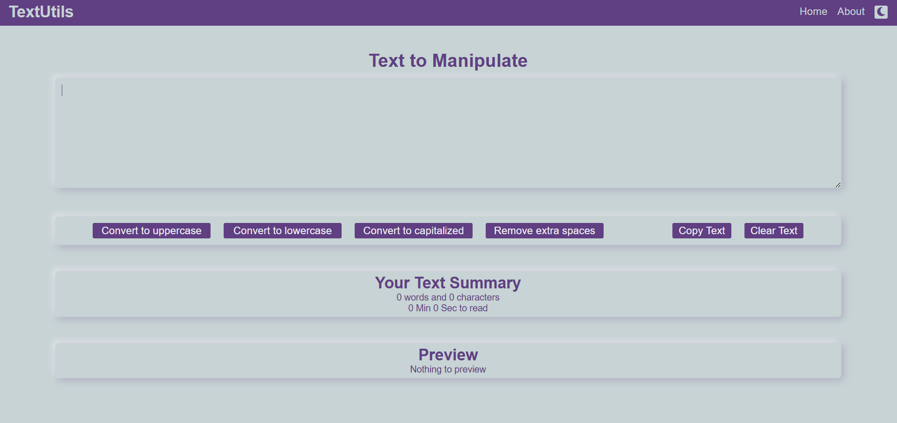

# TextUtils

TextUtils is a real-time word and character counting utility that allows you to manipulate text the way you want. I got the idea for this app while exploring React, and decided to build it from scratch in my own style as a hands-on project.

## Features

- Word count
- Character count
- Text manipulation (e.g., convert to uppercase/lowercase)
- Real-time preview
- Light and dark theme support
- Clean and responsive UI

## Screenshot

## Pages

- **Home**
- **About**

## Technologies Used

- React
- HTML
- CSS
- Javascript

## Live Demo

[View Website](https://kuldeepchavda01.github.io/TextUtils/)
